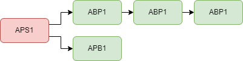

# Introduction

OpenComms analog system operates on the principles of the widely recognized ClearCom analog partyline infrastructure to provide an open communication solution. 
Similar to ClearCom, OpenComms utilizes a 2-wire interface. 
The core functionality remains the same, with a main station serving as the central hub for communication and beltpacks acting as portable endpoints for users. 
The analog system ensures real-time, instantaneous audio transmission, enabling seamless coordination among production teams.

**Please note that OpenComms is an open-source DIY system, which means it comes with inherent risks. 
While efforts have been made to ensure its functionality and reliability, it's important to recognize that building and using OpenComms devices involves technical expertise and potential challenges. 
As with any DIY project, there may be unforeseen issues, compatibility limitations, or potential risks involved. 
It is recommended to proceed with caution, have a good understanding of the system's components and requirements, and follow proper safety precautions.**

## How does it work

The master station / power supply is the central control unit of the system. It provides power to the loop and acts as a "party-line supervisor," controlling the audio levels and preventing feedback and crosstalk.

The remote stations are the individual intercom units that are connected to the loop. Each remote station includes a speaker, microphone, and a push-to-talk button.

The intercom loop is typically wired in a daisy-chain configuration, with each remote station connected to the loop with a two-conductor cable. The loop can be very long, depending on the number of stations and the cable type.

Here is a example:  

The OpenComms system includes a call signaling feature that allows users to "page" other stations on the loop. When a user presses the call button on their remote station, a signal is sent to all other stations on the loop making their LED ring blink, alerting them to the incoming call.

