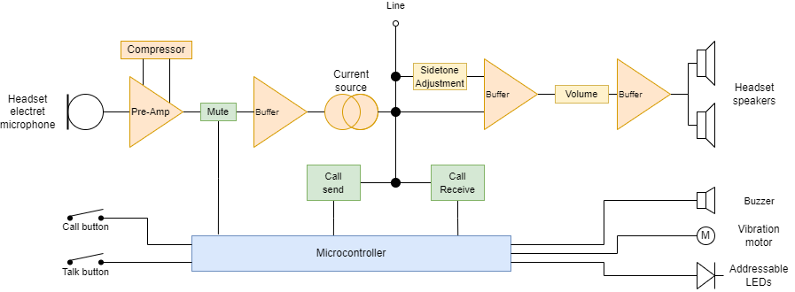

# Technical details

Welcome to the technical documentation for the Opencomms Analog Partyline System. This page aims to provide an in-depth understanding of the inner workings of this intercom system.

## Loop
The loop is a fundamental part of the Opencoms intercom system, responsible for creating a communication pathway between multiple stations and beltpacks.

Typically, the loop consists of a daisy-chain connection, where each device is connected in series to form a continuous loop. This ensures that audio signals can pass through each station and beltpack without interruption. 

Proper termination is crucial to prevent signal reflections and maintain signal integrity. 

## Power supply
Opencomms power supplies play a vital role in the intercom system, providing power to the loop and acting as a "party-line supervisor," controlling the audio levels and preventing feedback and crosstalk.

The power supplies are designed to supply a clean `30VDC` between `pin 1 (GND)` and `pin 2 (VCC)`. 

Termination is a critical aspect of setting up a partyline system to ensure optimal performance and signal integrity.
In a partyline system, termination is achieved by using termination resistors placed at the end or start of the loop. This resistors is typically arround `200 ohms` and connected between `pin 1 (GND)` throught a capacitor to `pin 3 (Signal)`. 

The termination resistors act as loads, absorbing the transmitted audio signal and preventing it from reflecting back into the loop and creating feedback loops.

It is important to note that termination is only needed at one device in the loop (typically the power supply), and not at every station or beltpack. Terminating each device individually would result in a degraded performance of the overall system.

## Remote station
Here is an overview of how a basic remote station should work

*Please be aware that while the principles outlined above are generally applicable to analog partyline remote stations, there may be variations in features and technical details between different manufacturers and models.*

### Call
When a call is initiated, it closes a circuit that introduces a DC voltage onto the partyline loop. This DC voltage is superimposed onto the existing audio signal, carrying the call signal information.

Receiving stations within the partyline loop detect the presence of this DC voltage. Upon detecting the call signal, the station activate visual indicators, such as LEDs, or audible alerts to notify the users of an incoming call.